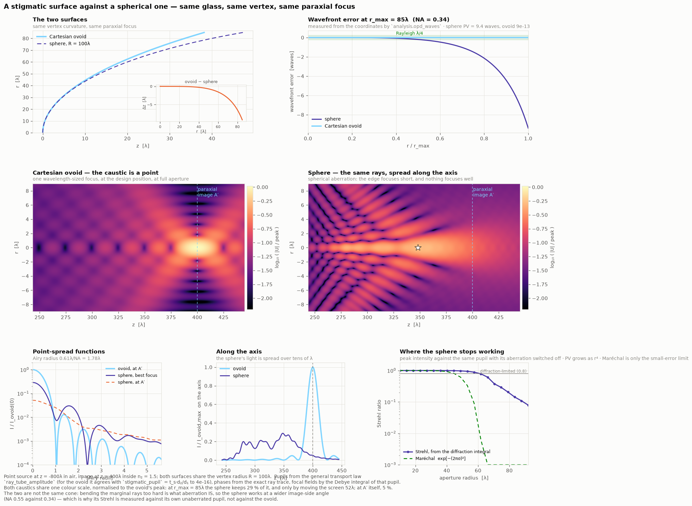
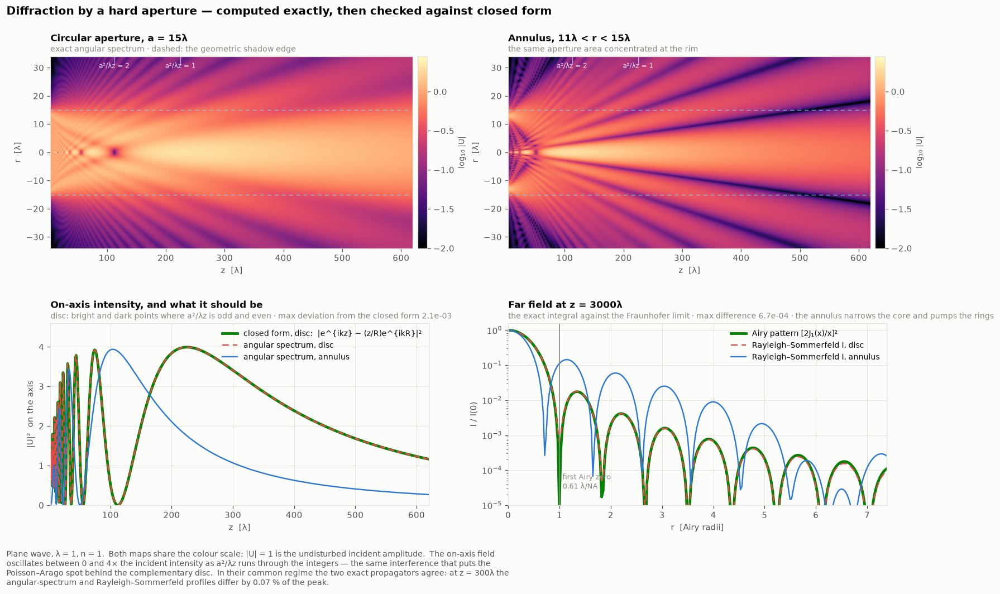
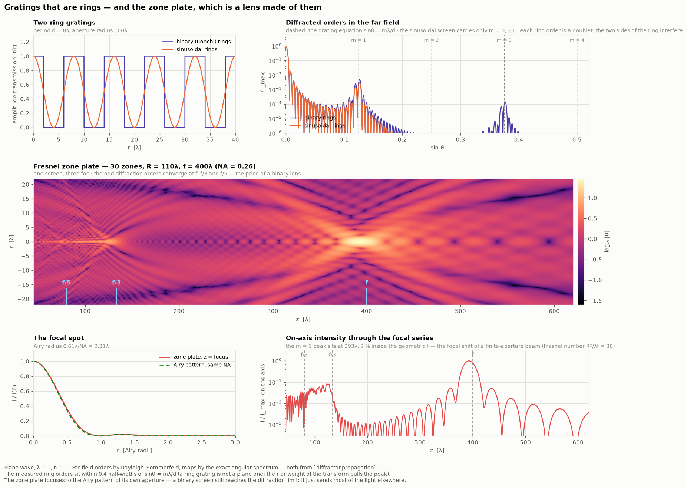
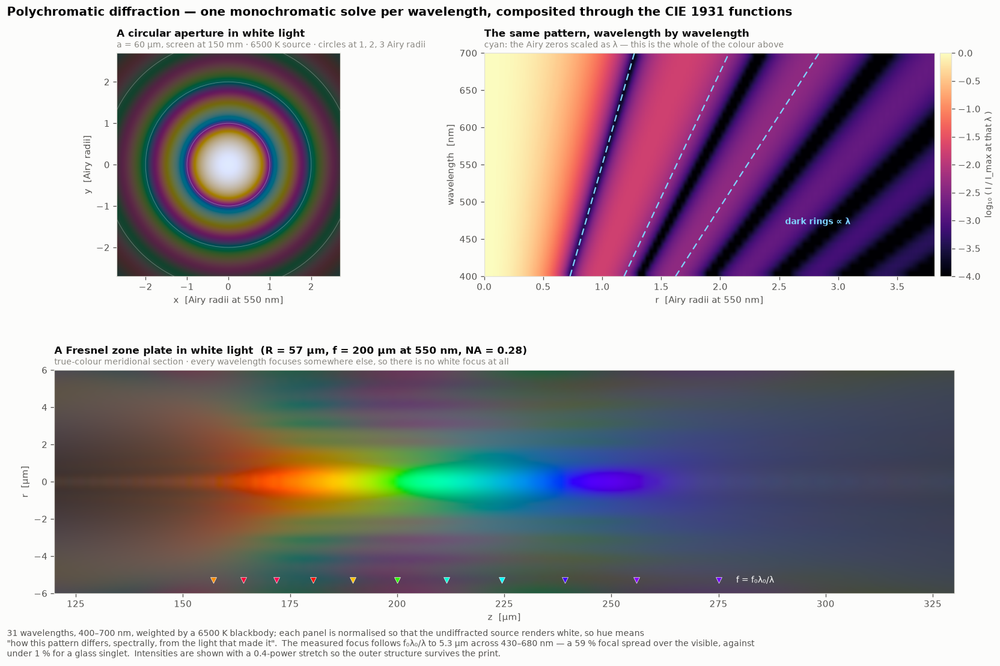
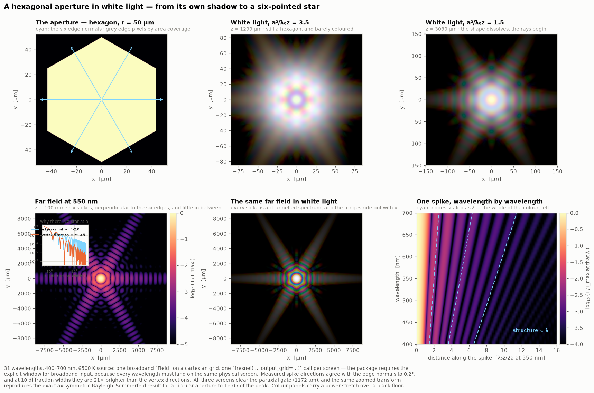
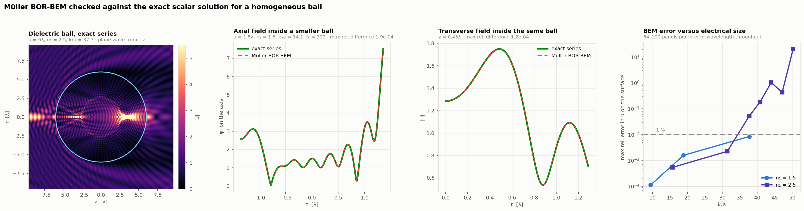
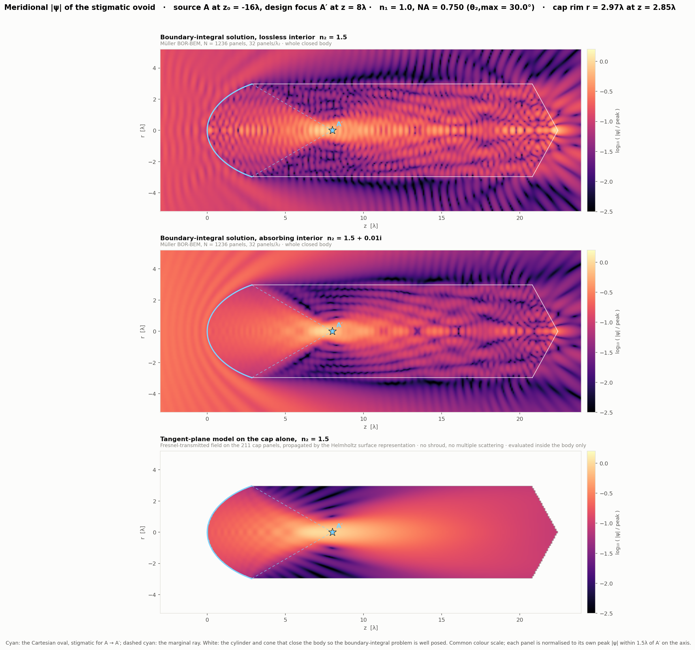

# Diffractor

**Scalar wave optics in which the interface is taken seriously.**

Most diffraction toolkits model a lens as a phase mask: multiply the field by
`exp(i k Δ(x,y))` and propagate. That is a boundary condition nobody derived,
and it silently violates energy conservation the moment the surface is steep.
Diffractor is built the other way round — geometry, media, interface response
and transport are separate things, each one measured against something that
cannot be argued with:

```
    exact analytic     →      groundtruth (BOR-BEM)      →      diffractor
   scalar ball, planar        Müller second-kind solver,        exact propagators
   interface, R+T = 1         O(h²) convergence                 + interface operators
```

Nothing enters the physical core without a reference to check it against, and
when the reference turns out to be wrong the claim is retracted rather than
kept (see [Status](#status-the-validation-ladder) — that has already happened
once, and the retraction is in the repository).



*The whole point of the library in one figure: two surfaces of the **same
vertex curvature**, so the same paraxial focus, differing only in how they bend
the outer rays. The Cartesian ovoid is stigmatic by construction — its measured
wavefront error is 10⁻¹² waves at any aperture — while the sphere loses 9.4
waves peak-to-valley and smears its focus over 130 λ. From
[`examples/04_stigmatic_vs_spherical.py`](examples/04_stigmatic_vs_spherical.py).*

---

## Contents

- [Install](#install) · [60 seconds](#60-seconds)
- [Quickstarts](#quickstarts) — seven short, complete programs
- [Gallery](#gallery) — diffraction, gratings, white light, aberration
- [Status: the validation ladder](#status-the-validation-ladder)
- [What is in the box](#what-is-in-the-box) · [Conventions and traps](#conventions-and-traps)
- [Notebooks](#notebooks) · [Tests](#tests) · [Repository layout](#repository-layout)

---

## Install

Python ≥ 3.10, NumPy and SciPy. From the repository root:

```bash
git clone https://github.com/blancusjh/Diffractor.git
cd Diffractor
pip install -e diffractor -e groundtruth     # two packages, one workspace
pip install pytest matplotlib                # tests, and the example figures
python -m pytest tests/                      # 69 assertions, ~1 min
```

`groundtruth` is only needed to *check* `diffractor`; the physical core never
imports it.

## 60 seconds

```python
import numpy as np
from diffractor import Grid, MonochromaticField, angular_spectrum, mm, um

lam, a, z = 0.5*um, 25.0*um, 300.0*um
grid = Grid.polar(np.linspace(0.0, a, 2001))   # the aperture IS the domain: a
U = MonochromaticField(grid, np.ones(grid.shape), lam)   # hard edge, no aliasing

Uz = angular_spectrum(U, z)                    # exact; Hankel path, because the
                                               # grid says "polar"
k = 2 * np.pi / lam                            # the closed form on the axis
exact = np.exp(1j*k*z) - z/np.hypot(a, z) * np.exp(1j*k*np.hypot(a, z))
print(abs(Uz.u[0, 0]), abs(exact))             # 0.4928   0.4949
```

That is the whole style of the library: a field on a typed grid, exact
operators that read everything off it, and a closed form next to them
whenever one exists.

---

## Quickstarts

Each block runs on its own (after the imports of the ones before it).

### 1 · Diffract from a plane, exactly

`propagation` solves Helmholtz in a homogeneous half-space with no further
hypothesis. Two independent operators, one physics — and neither takes a
wavelength or an index, because the field carries its own:

```python
from diffractor import rayleigh_sommerfeld

out = Grid.polar(np.linspace(0.0, 60*um, 400))
U_asm = angular_spectrum(U, z, output_grid=out)
U_rs1 = rayleigh_sommerfeld(U, z, output_grid=out)   # Rayleigh–Sommerfeld I
# they agree to 7e-3 of the peak on this hard-edged disc; RS1 reproduces the
# closed-form axial value to 6e-5, at any distance
```

`angular_spectrum` is `IFT2(e^{i·kz·z}·FT2(U))` — how the transform is
evaluated is the *grid's* business (FFT on cartesian, Hankel modes on polar).
`rayleigh_sommerfeld` integrates in real space and is the reference the
spectral methods are checked against; it is axisymmetric-only, and its error
message tells you why. Pick by regime, not by taste —
[`examples/01_apertures.py`](examples/01_apertures.py) shows where each one is
comfortable.

### 2 · A stigmatic interface, and its measured stigmatism

An `Interface` is a locus plus two media — nothing else. What light *does*
there lives in `scattering`, `propagation` and `analysis`:

```python
import numpy as np
from diffractor.optics import Medium, stigmatic_interface
from diffractor.analysis import opd_waves

iface = stigmatic_interface(Medium(1.0), Medium(1.5), zo=-200*um, zi=100*um)
g = iface.sample(n_pts=2001, rim_frac=0.98)       # vertex → rim, pure geometry

print(g["r"][-1] / um, np.degrees(g["th2"][-1]))  # 40.5 µm, 38.2° image-side
print(np.abs(g["snell"]).max())                   # 1.6e-15  Snell, as a residual
print(np.abs(opd_waves(iface, g, lam)).max())     # 5.7e-13 waves of wavefront error
```

Both numbers are *measurements*, not assumptions: `opd_waves` rebuilds `d₁` and
`d₂` from the `(r, z)` coordinates and compares the two-leg path with the axial
one. Stigmatism is what the residual says, never an input.

### 3 · The pupil: a special case, and the general law

```python
from diffractor.transport import ray_tube_amplitude, stigmatic_pupil
from diffractor.scattering import T_s
from diffractor.analysis import energy_through_sphere, predicted_pupil

P     = stigmatic_pupil(iface, g)                  # P = t_s · d₂/d₁
P_gen = ray_tube_amplitude(1.0, 1.5, g["w1"], g["w2"],
                           T_s(1.0, 1.5, g["cos_i1"], g["cos_i2"]))
print(np.abs(P[1:]/P_gen[1:] - 1).max())           # 6.7e-16 — the same thing

A = predicted_pupil(iface, g)                      # with the source amplitude
print(energy_through_sphere(A, g["th2"]))          # 2π∫|A|² sinθ dθ
```

`ray_tube_amplitude` is the general statement — `n₁|U₁|²dΩ₁·T = n₂|U₂|²dΩ₂` —
and holds for *any* surface, aberrated or not, because it never assumes the
outgoing bundle is homocentric. `stigmatic_pupil` is the collapse of that law
when both legs are exact spherical waves. Machine agreement between them is a
standing test of both.

### 4 · A flat interface, with no approximation at all

For a plane boundary the transmission operator is diagonal in the angular
spectrum — `IFT2(t(|k⊥|)·FT2(U))` — so it can be applied exactly, on any
basis. The returned field lives in the second medium:

```python
from diffractor import Medium
from diffractor.scattering import transmit

r = grid.axes[0]
Ug = MonochromaticField(grid, np.exp(-(r[:, None]/(8*um))**2), lam)
U2 = transmit(Ug, Medium(1.5))
print(U2.medium.n, abs(U2.u[0, 0]))     # 1.5   0.8003  = 2n₁/(n₁+n₂) + 3e-4
```

This is rung 1 of the validation ladder, and the primitive every curved-
interface scheme has to reduce to in the flat limit (the test pins
`FT2(U2) = t(k⊥)·FT2(Ug)` to 1e-4 on the field's own band).

### 5 · Paraxial, only where it is legal

The Fresnel propagator is a good tool inside its regime and a wrong answer
outside it, so it refuses to be used outside it:

```python
from diffractor import fresnel, fresnel_validity_distance

print(fresnel_validity_distance(a, lam) / um)   # 254.9 µm — 3× Goodman's z
fresnel(U, 100*um)                     # ValueError: outside validity
fresnel(U, 100*um, policy="warn")      # warns and proceeds
U_far = fresnel(U, 0.4)                # 40 cm: far field, natural output grid
```

`policy` is `"raise"` (default), `"warn"` or `"force"`. For a *broadband*
field `fresnel` additionally refuses to run without an explicit
`output_grid=`: its natural output plane scales with λ, and compositing
wavelengths that landed on different screens is meaningless — the package
makes that mistake impossible rather than documenting it.

### 6 · How much of your field is not going to propagate

```python
from diffractor import spectral_budget

print(spectral_budget(U))     # [0.00197] of the power beyond |k⊥| = n·k₀
```

The fraction beyond the propagating cone is the energy a band-limited angular
spectrum silently discards — the reason a thin-element boundary condition
leaks. Measure it before trusting a result near a sharp feature.
(It returns one number per spectral line — which brings us to:)

### 7 · White light is one Field, not a loop

A `Field`'s values carry a trailing spectral axis and its `Spectrum` carries
the source; every operator above vectorises over that axis:

```python
from diffractor import Field, Spectrum, nm

spec = Spectrum.blackbody(400*nm, 700*nm, 31, temperature=6500.0)
W = Field(grid, np.ones((*grid.shape, spec.n)), spec)     # white plane wave

img = fresnel(W, 5*mm, output_grid=Grid.polar(np.linspace(0, 400*um, 256)))
img.spectral_intensity      # (256, 1, 31) — per line, for CIE compositing
img.intensity               # (256, 1)     — weighted by the source spectrum
```

One call, 31 wavelengths, one shared screen. `examples/colorimetry.py` turns
`spectral_intensity` into sRGB.

---

## Gallery

Every figure below is produced by a script in [`examples/`](examples); the
numbers quoted in the captions are printed by those scripts when they run.

### Apertures — and what the answer should be



A hard circular aperture and an annulus, propagated exactly. The on-axis
intensity swings between 0 and 4× the incident value as the Fresnel number
`a²/λz` runs through the integers, and it lands on the closed form
`|e^{ikz} − (z/R)e^{ikR}|` to 2×10⁻³; the far field lands on `[2J₁(x)/x]²` to
3×10⁻⁴; the two exact propagators agree with each other to 6×10⁻³ on this
hard-edged worst case.
The annulus — same area, moved to the rim — narrows the core and pumps the
rings, which is the whole idea behind apodizing masks.
→ [`01_apertures.py`](examples/01_apertures.py)

### Gratings that are rings, and a lens made of them



A sinusoidal ring grating carries only `m = 0, ±1`; a binary one carries every
odd order, at the angles the grating equation predicts. Chirp the same binary
screen so every clear zone arrives in phase — `r_m = √(mλf)` — and it becomes a
lens: the Fresnel zone plate, focusing to the Airy pattern of its own aperture
while keeping the focal series `f`, `f/3`, `f/5` of the orders it came from.
The measured peak sits 2 % inside the geometric `f`: the focal shift of a
finite-aperture beam, not an error.
→ [`02_gratings_zoneplate.py`](examples/02_gratings_zoneplate.py)

### White light is just many monochromatic solves



Broadband is bookkeeping, and the `Field` does the bookkeeping: one field, a
`Spectrum.blackbody` of 31 lines on its trailing spectral axis, one propagator
call per screen — then `spectral_intensity` integrates against the CIE 1931
colour-matching functions ([`examples/colorimetry.py`](examples/colorimetry.py),
the analytic Wyman fit — no data files). A diffraction pattern scales as λ, so the aperture's rings fan
out into spectra; a zone plate's focal length goes as `1/λ`, so white light is
not focused at all but smeared over 59 % of `f` — diffractive optics has
chromatic aberration of the opposite sign, and a hundred times worse, than a
glass singlet. The measured foci follow `f₀λ₀/λ` to 5 µm across 430–680 nm.
→ [`03_polychromatic.py`](examples/03_polychromatic.py)

### A hexagon in white light — the six-pointed star



The one figure with no rotational symmetry, so the field lives on a cartesian
`Grid` and the same `fresnel` operator takes its matrix-DFT path instead of
the Hankel one — reproducing the exact axisymmetric Rayleigh–Sommerfeld disc
result to 10⁻⁵ of the peak on the way (the script prints the check).
Near the aperture the pattern is still a hexagon with fringes and almost no
colour: at a Fresnel number of 6 every wavelength does much the same thing.
Far from it the six edges throw six spikes **perpendicular to themselves** —
the measured directions land within 0.2° of the edge normals, and the far field
falls as r⁻² along a normal against r⁻³·⁶ towards a corner, which is *why*
there is a star: a straight edge radiates along its own normal, and away from
the normals only the corners are left. Each spike is a channelled spectrum, its
fringes sitting at radii ∝ λ. This is what a camera iris does to a bright
light.
→ [`05_hexagon_polychromatic.py`](examples/05_hexagon_polychromatic.py)

### Stigmatic against spherical

The figure at the top of this page, in numbers: at an 85 λ aperture radius
(NA 0.34) the sphere holds 29 % of the ovoid's peak intensity, and only if you
move the screen 52 λ; at the paraxial image itself, 5 %. Sweeping the aperture
shows the Strehl ratio tracking Maréchal's `exp[−(2πσ)²]` while the error is
small and leaving it behind once it is not — the classical estimate measured,
not quoted.
→ [`04_stigmatic_vs_spherical.py`](examples/04_stigmatic_vs_spherical.py)

| Script | Runtime | What it computes |
| --- | --- | --- |
| [`01_apertures.py`](examples/01_apertures.py) | ~13 s | circular and annular apertures; ASM vs RS1 vs closed form vs Airy |
| [`02_gratings_zoneplate.py`](examples/02_gratings_zoneplate.py) | ~20 s | ring gratings, the grating equation, and the zone plate's focal series |
| [`03_polychromatic.py`](examples/03_polychromatic.py) | ~10 s | one broadband Field composited to sRGB; chromatic focal spread |
| [`04_stigmatic_vs_spherical.py`](examples/04_stigmatic_vs_spherical.py) | ~10 s | exact ray trace, ray-tube pupils, Debye focal fields, Strehl sweep |
| [`05_hexagon_polychromatic.py`](examples/05_hexagon_polychromatic.py) | ~17 s | a hexagon from near field to six-pointed star, in white light |

Three support modules sit beside them: `style.py` (the shared plot style),
`colorimetry.py` (CIE 1931 → sRGB) and `masks.py` (supersampled hard masks for
cartesian grids).

```bash
python examples/01_apertures.py     # from anywhere; figures land in docs/images/
```

---

## Status: the validation ladder

The interface operator is built one rung at a time; a rung is not climbed until
the one below it passes ([`benchmarks/cases.md`](benchmarks/cases.md)).

| # | Case | Reference | Status |
|---|------|-----------|--------|
| 1 | Planar interface, oblique plane wave | exact spectral `t(k⊥)` | primitive implemented (`scattering/planar.py`), ladder test pending |
| 2 | Planar interface, point source | RS1 + `t(k⊥)` | pending |
| 3 | Shallow spherical cap | BEM + exact scalar ball | pending |
| 4 | Stigmatic ovoid, NA 0.3–0.75 | `P = t_s·d₂/d₁` + BEM | **blocked** — see below |
| 5 | Full sphere, caustic regime | exact scalar ball | pending |

The solver itself is checked and works: Müller BOR-BEM against the exact series
for a homogeneous ball, `O(h²)`, agreeing to ~10⁻³ over the usable range of
`k₂a`.



Rung 4 is blocked, and the reason is worth reading before trusting any
benchmark: closing the ovoid so the boundary-integral problem is well posed
turns it into a **lossless dielectric cavity**. Varying only the length of the
closing shroud — a parameter downstream of the converging cone, which cannot
affect the physics — swings the measured edge factor by ±38 %. So the earlier
measurement that appeared to confirm `P = t_s·d₂/d₁` to 0.25 % is **retracted**:
it was contaminated by a reverberant field. Mesh convergence had been verified
and was excellent; it converged beautifully to the answer for the wrong
geometry. Integrated quantities survive averaging (energy through S₂ is stable
at 1.20 ± 0.01 × prediction), the pointwise edge factor does not. The fix is an
open-surface formulation — which is also the physically right model of a lens
with a rim.



*The same body solved three ways. Middle: an absorbing interior damps the
cavity while leaving the direct converging beam intact — which is how the
trapped field was diagnosed. Bottom: the tangent-plane model on the cap alone,
the thing `diffractor` actually implements.*

The focal region and the field on the two reference spheres — the measurement
protocol itself — are in [`benchmarks/f2_focal.png`](benchmarks/f2_focal.png)
and [`benchmarks/f3_spheres.png`](benchmarks/f3_spheres.png).
[`PLAN.md`](PLAN.md) has the phase roadmap (in Spanish).

---

## What is in the box

`diffractor` is ordered by *the nature of each thing* — space, time, fields,
then what acts on them:

| Module | Holds | Key names |
| --- | --- | --- |
| `space.py` | samples of the plane, typed by basis | `Grid` (`.cartesian` / `.polar` / `.custom`), `weights()`, `reciprocal()` |
| `basis.py` | the coordinate bases and their maps | `Basis`, `CARTESIAN`, `POLAR` |
| `spectrum.py` | the time side of a field | `Spectrum` (`.line` / `.flat` / `.blackbody`) |
| `field.py` | samples of a function of space and time | `Field` (trailing spectral axis), `MonochromaticField` |
| `fourier.py` | one transform, per-basis evaluation | `FT2`, `IFT2` (FFT / matrix DFT / θ-FFT + per-mode Hankel), `PolarPlan` |
| `hankel.py` | the radial kernel of the polar FT | `hankel_transform`, `inverse_hankel_transform`, `hankel_matrix` |
| `propagation.py` | transport from plane to plane | `angular_spectrum`, `fresnel` (gated), `fraunhofer`, `rayleigh_sommerfeld`, `spectral_budget` |
| `transport.py` | geometric energy conservation | `ray_tube_amplitude`, `stigmatic_pupil` |
| `sampling.py` | the closed-form sampling criteria | `fresnel_min_distance`, `fresnel_max_spacing`, `next_fft_size` |
| `units.py` | metre-based length constants | `m`, `cm`, `mm`, `um`, `nm` |
| `geometry/` | pure shape — no media, no fields | `DescartesOvoid` (exact, closed-form, parametrised by `d₁`) |
| `optics/` | matter and where it ends | `Medium`, `Interface`, `stigmatic_interface` |
| `scattering/` | the interface response | `t_s`, `r_s`, `T_s`, `R_s`, `snell_cos`, `point_source_transmission`, `t_spectral`, `transmit` |
| `sources/` | what emits | `point_source`, `point_source_normal_derivative` |
| `analysis/` | what is measured | `two_leg_opl`, `invariant_opl`, `opd_waves`, `demodulate`, `predicted_pupil`, `energy_through_sphere` |

`groundtruth` holds the references: `exact/` (closed-form scalar ball),
`bem/` (Müller BOR-BEM, field maps, bodies) and `protocol/` (demodulation on
the reference sphere, energy budget). It is never imported by `diffractor`.

## Conventions and traps

- **Units.** Metre base, through `diffractor.units`: write `550*nm`, read
  back `r/um`. The wavelength on a `Spectrum` is always the *vacuum*
  wavelength; the index lives on the field's `Medium`, so the medium
  wavelength is derived where it matters, never passed around.
- **The basis lives in the grid, not in the method.** `angular_spectrum`,
  `fresnel` and `fraunhofer` are each written once, on `FT2`/`IFT2`; a polar
  grid routes them through the angular decomposition (θ-FFT + per-mode Hankel,
  the Jacobi–Anger identity), a cartesian one through the FFT or a matrix DFT.
  Axisymmetry is `n_theta=1`, not a separate code path — and the cross-basis
  agreement of the two evaluations (10⁻⁶ of peak on the transform, 10⁻⁵ on a
  propagated smooth field) is asserted in the test suite.
- **The aperture is the domain (polar).** Radial grids run `0 → a`, so a hard
  edge is exact and costs no sampling error. On cartesian grids a hard mask is
  pixelated — supersample its edges (`examples/masks.py`) or expect streaks.
- **`fresnel` is gated; broadband `fresnel` needs a window.** The paraxial
  integral refuses outside Goodman's regime (`policy` = raise/warn/force), and
  a broadband field must name an `output_grid` so every wavelength lands on
  one physical screen.
- **The polar quadrature has honest knobs, not hidden ones.** Its accuracy is
  set by the band and density of the k-axis: `reciprocal(k_max=, n_k=)`.
  The defaults are named constants with measurements behind them
  (`POLAR_BAND_FRACTION`, `BESSEL_SAMPLES_PER_PERIOD`,
  `ASM_SAMPLES_PER_PERIOD`) — and the propagator densifies with z, because the
  transfer phase `kz·z` turns faster the further you go. The deep near field
  of a *hard edge* is the one regime where the band-edge always wins:
  `rayleigh_sommerfeld` is the reference there, reproducing the closed-form
  axial value to 6×10⁻⁵. `bandlimit`/`pad_factor` belong to the cartesian
  FFT path (circular convolution, phase aliasing) and are refused — with the
  reason — on polar fields.
- **`t_s` is the scalar/TE coefficient, and only that.** It is what the scalar
  Helmholtz transmission conditions give. Do not average it with `t_p`: that
  belongs to Maxwell, not to this framework.
- **Amplitudes are absolute.** The point source carries `A₀ = 1/4π` and its
  `1/d`; pupils and energies are never rescaled to fit a reference.
- **Array layout is `'ij'`.** `values[i, j, l]` is (first axis, second axis,
  spectral line): x before y, r before θ. Transpose for `imshow`, which wants
  rows = y.

## Notebooks

Four notebooks, committed with their outputs, in the order the physics is built
up — see [`notebooks/README.md`](notebooks/README.md):

1. `01_stigmatic_geometry.ipynb` — the Cartesian oval; stigmatism, Snell and the
   ray tubes verified from the coordinates.
2. `02_solver_validation.ipynb` — Müller BOR-BEM against the exact scalar ball.
3. `03_stigmatic_focus.ipynb` — the field of the ovoid: sections, focal region,
   reference spheres.
4. `04_models_against_the_solver.ipynb` — tangent-plane, Debye–Wolf and
   thin-element models, scored.

```bash
pip install -e diffractor -e groundtruth
jupyter lab notebooks/
```

## Tests

The suite asserts physics, not plumbing: Snell as a residual, the invariant
OPL, `R_s + T_s = 1`, the ray-tube identity against `t_s·d₂/d₁`, the angular
spectrum against Rayleigh–Sommerfeld and against closed forms (the on-axis
disc field, the Airy pattern), Parseval in both bases, the cross-basis
agreement of `FT2` (the same anisotropic function through the FFT and through
the Jacobi–Anger/Hankel path, 10⁻⁶ of peak), a broadband propagation equal to
its per-wavelength loop, and the Fresnel gate refusing what it should refuse.

```bash
python -m pytest tests/          # 69 passed
```

## Repository layout

```
diffractor/          the product (installable, src/ layout) — flat modules in
                     ontological order: space, spectrum, field, fourier,
                     hankel, propagation, transport, sampling, units; plus
                     geometry/, optics/, scattering/, sources/, analysis/
groundtruth/         the references — exact/, bem/, protocol/ (never imported
                     by diffractor)
benchmarks/          frozen results in golden/*.npz + the figures that read them
                     (compute_fields.py ~15 min, fig_fields.py seconds)
examples/            the gallery above; each script prints its own checks
notebooks/           the physics, built up in order, with outputs committed
tests/               every claim, as assertions — including the cross-basis
                     agreement of the Fourier and propagation operators
docs/images/         figures produced by examples/
PLAN.md              phases, the validation ladder, and the recorded failures
```
