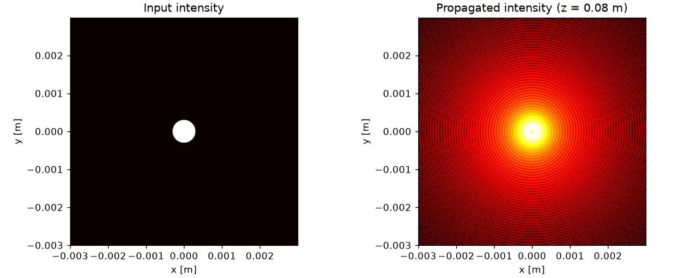
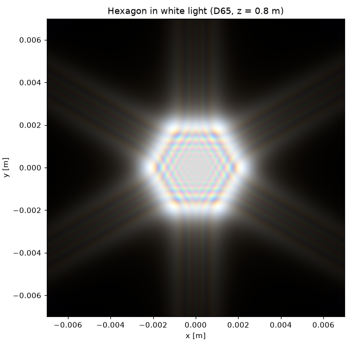
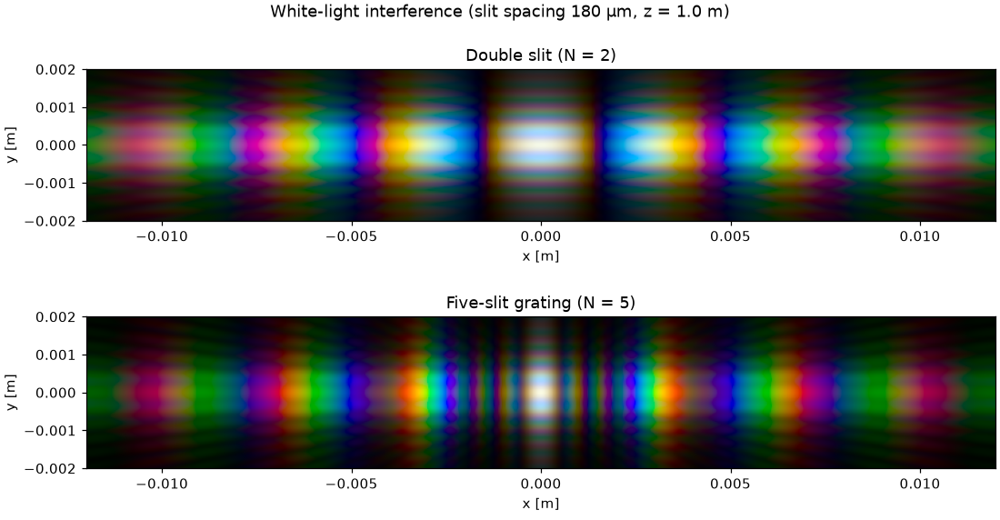
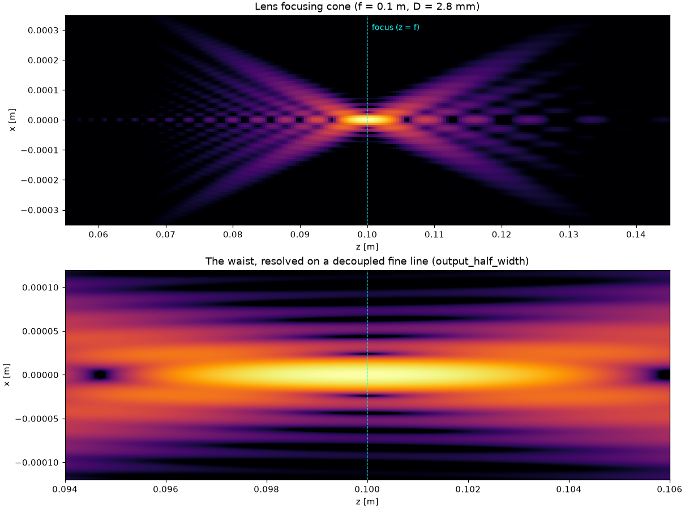
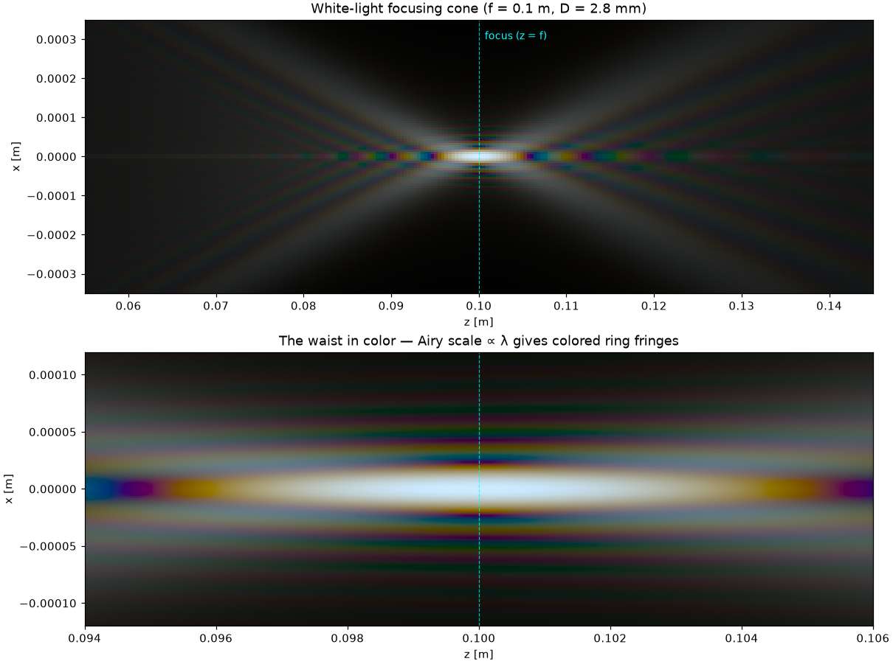
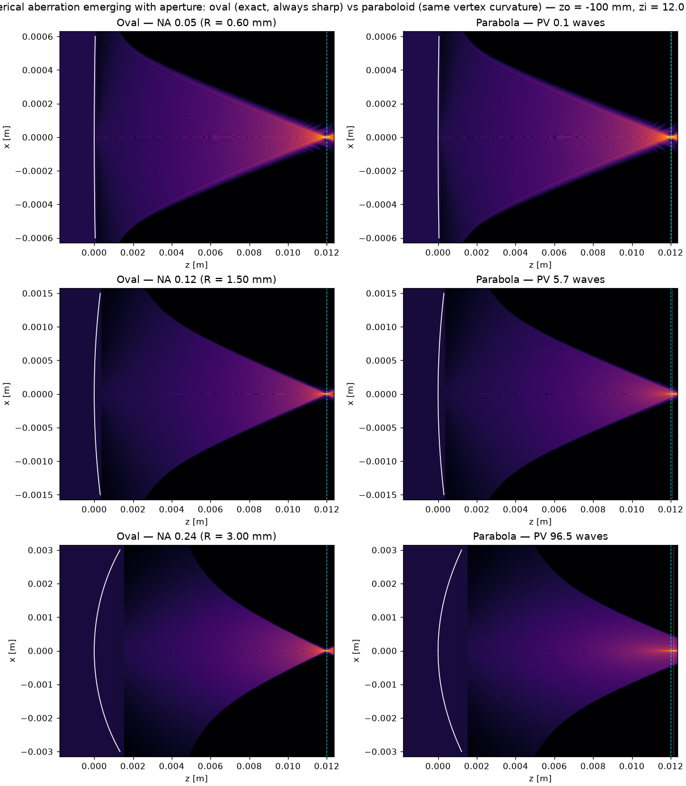

# diffractor

A small, tested scalar-diffraction toolkit built on NumPy. It propagates
complex optical fields with Fourier-optics methods and models apertures and
thin refracting surfaces.


*One continuous propagation per surface — incident beam, refractor, converging
cone, focus, and the diverging field beyond — from
[`examples/cartesian_vs_parabolic_aberration.py`](examples/cartesian_vs_parabolic_aberration.py):
the exact stigmatic Cartesian oval (left) against its paraboloid (center) at
NA 0.24, with the focal-plane PSFs below.*

The primary API is the fluent `MonochromaticField`: you build a field on a
`Grid`, chain optical elements onto it, and propagate — each step reads as one
pipeline.

```python
U = (MonochromaticField(grid, 1.0, wavelength=532e-9)   # unit plane wave on the grid
     .add_aperture(circular_aperture, 0.3e-3, antialiased=True)
     .propagate(1.15, method="fresnel"))                # -> a field on the output plane
```

The field carries its own `wavelength` and medium index `n`, so the propagators
never repeat them. Underneath sits an immutable `Field` — the sampling `Grid`
plus its complex samples — reachable with `.to_field()` for the Fourier
operators (`FT2`, `IFT2`) and any low-level routine.

Its broadband sibling `PolychromaticField` shares the exact same building
syntax, but carries an array of `wavelengths`; it replays the build at each one
and composites the result to a true-color sRGB image:

```python
img = (PolychromaticField(grid, 1.0, wavelengths=wl, weights=d65_weights(wl * 1e9))
       .add_aperture(polygon_aperture, 6, 0.5e-3, antialiased=True)   # a hexagon
       .propagate(0.3, method="fresnel_zoom", output_half_width=2e-3))
img.plot(ax)                                            # -> a colored hexagonal pattern
```

Wavelength-dependent elements (`add_lens`, `add_surface`, `add_phase_grating`)
automatically get their correct per-λ phase; amplitude masks stay
wavelength-independent.

## Package layout at a glance

The code is split into three subpackages, and every public name is also
re-exported flat from the top-level `diffractor` namespace:

- **`diffractor.physics`** — fields (`MonochromaticField`, `PolychromaticField`,
  `Field`), sources, apertures, gratings, surfaces, propagators,
  longitudinal/polychromatic propagation and aberrations: the optical core.
- **`diffractor.mathutils`** — grids, the Fourier operators, Fresnel sampling
  criteria and the CPU/GPU array backends: the numerical utilities.
- **`diffractor.viz`** — matplotlib helpers, interactive VisPy viewers and the
  CIE colorimetry used to composite broadband fields to sRGB.

## Gallery

A tour of what the toolkit renders, organized by feature area. Every image
below is produced by a runnable script in [`examples/`](examples) — click
through to reproduce it.

### Basic diffraction

|  |
| --- |
|  |
| A circular aperture, propagated with the angular-spectrum method — [`simple_asm_diffraction.py`](examples/simple_asm_diffraction.py) (see also [`simple_fresnel_diffraction.py`](examples/simple_fresnel_diffraction.py) for the single-FFT Fresnel method). |

### Polychromatic (white-light) rendering

|  |  |
| --- | --- |
|  |  |
| Hexagonal aperture in D65 white light — [`hexagon_polychromatic.py`](examples/hexagon_polychromatic.py) | Double- and five-slit white-light interference — [`double_slit_white_light.py`](examples/double_slit_white_light.py) |


*Animated — a square grating imaged by a real refracting singlet (`CartesianSurface`,
not the idealized `thin_lens`) in white light, sweeping the screen through focus:
[`oval_grating_polychromatic_animation.py`](examples/oval_grating_polychromatic_animation.py).*

### Longitudinal (edge-on) fields

|  |  |
| --- | --- |
|  |  |
| Monochromatic focusing cone, edge-on — [`lens_longitudinal_focus.py`](examples/lens_longitudinal_focus.py) | The same cone in white light — [`lens_longitudinal_polychromatic.py`](examples/lens_longitudinal_polychromatic.py) |

### Aberration: stigmatic oval vs. paraboloid

The [flagship comparison](#diffractor) at the top of this page shows a single
very-high-NA case; swept across three apertures, it shows spherical
aberration *emerging* as the aperture opens:



*Low → medium → very-high NA (top → bottom): the exact oval focuses to a
diffraction-limited point at every aperture; the paraboloid — same vertex
curvature — degrades from imperceptible (0.1 waves) to a destroyed image
(96.5 waves) —
[`oval_vs_parabola_apertures.py`](examples/oval_vs_parabola_apertures.py).*

## Features

- **The fluent field** (`diffractor.physics.monochromatic`) —
  `MonochromaticField(grid, source, wavelength=...)` builds a single-wavelength
  field (a callable `f(x, y)` or a constant across the grid), then chains
  `.add_aperture` / `.add_grating` / `.add_lens` / `.add_surface` / `.add_phase`
  and propagates with `.propagate(z, method=...)` or slices an edge-on
  `.longitudinal(zs)`. It carries `wavelength` and `n`, wrapping the immutable
  `Field` (reachable via `.to_field()`).
- **The broadband field** (`diffractor.physics.polychromatic`) —
  `PolychromaticField(grid, source, wavelengths=..., weights=...)` has the same
  builder methods, records them, and replays them at each wavelength;
  `.propagate(z, method=...)` returns a `PolychromaticImage` (an sRGB array +
  its grid, with `.plot(ax)`), and `.longitudinal(zs)` a true-color
  `RGBLongitudinalSection`.
- **Field & Grid** (`diffractor.physics.field`, `diffractor.mathutils.grids`) —
  `Field` bundles a `Grid` with its samples; `Grid` owns coordinate access
  (`.x`, `.y`, `.spacing`) and still unpacks as `x, y = grid`.
- **Fourier operators** (`diffractor.mathutils.fourier`) — `FFT2` / `IFFT2`
  (centered array FFTs on the native grid) and `FT2` / `IFT2` (field operators
  that also accept an explicit target grid and evaluate the transform there, via
  an exact matrix DFT or an optional chirp-Z fast path). Plus `frequency_grid`.
- **Propagators** (`diffractor.physics.propagation`), selected by
  `.propagate(z, method=...)` or callable directly:
  - `fresnel_propagator` — single-FFT Fresnel (near-field, paraxial) method,
    with its scaled output plane given by `fresnel_output_grid`.
  - `fraunhofer_propagator` — far-field limit on the same output grid.
  - `fresnel_zoom_propagator` — the same Fresnel integral evaluated by a
    direct (matrix) Fourier transform on a user-chosen output window, for
    resolving focal spots and other compact features.
  - `asm_propagator` — angular-spectrum method (`IFT2(H · FT2(field))`), same
    grid in and out; supports back-propagation (`z < 0`), evanescent decay,
    and — via an explicit `output_grid` — decoupled output sampling (MPASM).
- **Batched / GPU propagation** (`diffractor.AngularSpectrum`) — a reusable
  angular-spectrum object that precomputes the transfer function and the input
  FFT once, so a z-sweep, movie or depth stack costs one inverse FFT per plane
  (`propagate`, `propagate_stack`, `intensity_stack`). Runs on the CPU (NumPy)
  or, with the `gpu` extra, on an NVIDIA GPU (CuPy) — chosen automatically from
  the input array or forced with `device="gpu"`.
- **Interactive viewers** (`diffractor.viz`, optional `viz` extra) — VisPy,
  GPU-rendered pan/zoom viewers for large fields: `plot_scalar_field` (2D),
  `plot_scalar_field_3d` (surface mesh) and `animate` (z-sweep movie with
  play/pause and frame-stepping).
- **Grid sizing** (`diffractor.mathutils.sampling`) — `recommend_grid_convergence`
  picks an adequate near-field grid by convergence testing (the honest fix for
  input-side aliasing, which no output-grid trick can cure), plus the Fresnel
  sampling criteria `fresnel_min_distance` / `fresnel_max_spacing` and
  `next_fft_size`.
- **Polychromatic rendering** (`diffractor.physics.polychromatic`,
  `diffractor.viz.colorimetry`) — the fluent `PolychromaticField` (above), or
  the underlying `propagate_polychromatic`, propagates a broadband field
  wavelength-by-wavelength onto a shared output grid and
  composites the result to an sRGB image through the CIE 1931 color-matching
  functions (analytic Wyman fit — no data file), with D65 / blackbody
  illuminants and display controls (`saturation`, `stretch`, `brightness`) for
  vivid renders. `wavelength_to_rgb`, `spectrum_to_srgb`, `plot_rgb`.
- **Gratings** (`diffractor.physics.gratings`) — amplitude (`ronchi_grating`,
  `sinusoidal_amplitude_grating`), 2D `cross_grating`, polar `polar_grating`
  (concentric rings × angular spokes), and chromatic `phase_grating`
  (sinusoidal / binary / blazed sawtooth). Orders land at `x_m = m λ z / d`.
- **Apertures** (`diffractor.physics.apertures`) — circular, rectangular,
  square, annular, elliptical and slit masks, regular-polygon (`polygon_aperture`,
  e.g. a hexagon) and multi-slit (`nslit_aperture`, e.g. Young's double slit),
  all with adjustable centers; a `lattice_aperture` that tiles any of them on a
  square or hexagonal lattice (hole arrays). Pass `antialiased=True` to
  `.add_aperture` to evaluate any mask with area-coverage (grey) edge pixels.
- **Surfaces & lenses** (`diffractor.physics.surfaces`) — `ParabolicSurface`
  and the stigmatic Cartesian-oval `CartesianSurface` (sag profile +
  thin-element `phase_mask`), plus an ideal `thin_lens` phase element
  (`.add_lens`) that forms a field's Fraunhofer pattern at its back focal plane.
- **Sources** (`diffractor.physics.sources`) — Gaussian beams and (tilted)
  plane waves, when you want an explicit source `Field`.
- **Aberrations** (`diffractor.physics.aberrations`) — Noll-indexed,
  RMS-normalized Zernike polynomials, least-squares wavefront fitting
  (`fit_zernikes`), synthesis, PV/RMS metrics and the Maréchal Strehl estimate.
- **Backends** (`diffractor.mathutils.backend`) — CPU/GPU array-module
  resolution (`array_module`, `asnumpy`, `to_device`). The GPU path is
  `AngularSpectrum` (plus the `FFT2`/`IFFT2` operators), which runs unchanged on
  NumPy or CuPy; the one-shot functional propagators are NumPy-first.
- **Longitudinal fields** (`diffractor.physics.longitudinal`) —
  `.longitudinal(zs)` (or `longitudinal_field`) sweeps a field through a range
  of distances and slices a transverse line at each plane to build an `x–z` (or
  `y–z`) cross-section — a lens's focusing cone, a beam waist, or a grating's
  Talbot self-imaging carpet — drawn with `plot_longitudinal`. Pass
  `output_half_width`/`output_samples` to sample the line on a decoupled window
  (matrix-DFT), resolving e.g. a focal waist far finer than the input spacing
  without enlarging the input `N`.
- **Helpers** — `make_grid` for FFT-friendly sampling grids and
  `plot_intensity` for quick log-intensity figures.

All quantities are in SI units (meters); `wavelength` is always the vacuum
wavelength and `n` the refractive index of the propagation medium.

## Installation

```bash
git clone https://github.com/blancusjh/diffractor.git
cd diffractor
pip install -e .          # core (NumPy + matplotlib)
pip install -e ".[dev]"   # + pytest, to run the tests
pip install -e ".[viz]"   # + VisPy interactive viewers (diffractor.viz)
pip install -e ".[gpu]"   # + CuPy GPU backend (pick the wheel for your CUDA)
```

## Quick start

```python
import matplotlib.pyplot as plt
from diffractor import MonochromaticField, make_grid, circular_aperture

grid = make_grid(2048, 6e-3)                        # 2048×2048 samples over 6 mm

U0 = MonochromaticField(grid, 1.0, wavelength=532e-9).add_aperture(
    circular_aperture, 0.3e-3, antialiased=True)    # unit plane wave through a soft-edged pupil
Uz = U0.propagate(1.15, method="fresnel")           # a field on the scaled output grid

fig, ax = plt.subplots(1, 2, figsize=(10, 4), constrained_layout=True)
U0.plot(ax[0], title="Aperture")
Uz.plot(ax[1], title="Fresnel pattern at z = 1.15 m")
plt.show()
```

`.propagate` returns another `MonochromaticField`, so you keep chaining:
`.propagate(...).add_lens(...).propagate(...)`. Reach the raw samples with
`Uz.values`, the intensity with `Uz.intensity`, or the underlying `Field` with
`Uz.to_field()`.

### Fourier as an operator, on any grid

```python
from diffractor import MonochromaticField, FT2, IFT2, Grid, circular_aperture, make_grid
import numpy as np

grid = make_grid(1024, 6e-3)
U0 = MonochromaticField(grid, 1.0).add_aperture(
    circular_aperture, 0.3e-3, antialiased=True).to_field()   # a low-level Field

spectrum = FT2(U0)                 # -> Field on the native frequency grid
back = IFT2(spectrum)              # -> Field, IFT2(FT2(U0)) == U0

# Sample the transform on a chosen (zoomed) frequency window instead:
fx = np.linspace(-3e4, 3e4, 256)
kx, ky = np.meshgrid(fx, fx)
zoomed = FT2(U0, kgrid=Grid(kx, ky))   # exact matrix DFT (or chirp-Z with SciPy)
```

### White light through a grating

```python
import numpy as np
from diffractor import (
    PolychromaticField, make_grid, ronchi_grating, square_aperture, d65_weights,
)

grid = make_grid(1024, 4e-3)
wl = np.linspace(410e-9, 680e-9, 40)

# The amplitude grating is wavelength-independent (dispersion comes from
# propagation), so it is recorded once and replayed at each wavelength.
img = (PolychromaticField(grid, 1.0, wavelengths=wl, weights=d65_weights(wl * 1e9))
       .add_grating(ronchi_grating, 60e-6, duty=0.5)
       .add_aperture(square_aperture, 1.2e-3)
       .propagate(0.5, method="fresnel_zoom", output_half_width=27e-3))
# -> a white 0th order flanked by dispersed rainbow orders; draw with img.plot(ax)
```

### Batched and GPU propagation

Build the propagator once, then sweep many planes cheaply — on the GPU when
CuPy is installed:

```python
import numpy as np
from diffractor import AngularSpectrum, MonochromaticField, circular_aperture, make_grid

grid = make_grid(1024, 6e-3)
U0 = MonochromaticField(grid, 1.0, wavelength=532e-9).add_aperture(
    circular_aperture, 0.3e-3, antialiased=True)

prop = AngularSpectrum(U0.to_field(), wavelength=532e-9, pad_factor=2)   # device="gpu" to force CuPy
frames = prop.intensity_stack(np.linspace(5e-3, 0.12, 60))              # 60 planes, one IFFT each

from diffractor import animate            # needs the 'viz' extra
animate([np.log10(f + 1e-6) for f in frames], list(np.linspace(5e-3, 0.12, 60)))
```

### Propagating through a refracting surface

Surfaces act as thin phase elements: crossing an interface between media
`n1` and `n2` multiplies the field by `exp(i k0 (n1 - n2) z(x, y))`, where
the sag `z(x, y)` is measured toward the second medium (a ray at height
`(x, y)` covers that extra distance still inside `n1`). `.add_surface` applies
the mask and advances the field's medium index to `n2`, so the next
`.propagate` uses it automatically.

```python
from diffractor import MonochromaticField, ParabolicSurface, circular_aperture, make_grid

grid = make_grid(1024, 6e-3)
Uz = (MonochromaticField(grid, 1.0, wavelength=532e-9)
      .add_aperture(circular_aperture, 0.3e-3, antialiased=True)
      .add_surface(ParabolicSurface(focal_length=0.12), n1=1.0, n2=1.5)
      .propagate(0.2, method="asm", pad_factor=2))    # propagates in n = 1.5
```

## Examples

Runnable scripts live in [`examples/`](examples):

| Script | Demonstrates |
| --- | --- |
| `simple_fresnel_diffraction.py` | Fresnel pattern of a circular aperture |
| `simple_asm_diffraction.py` | Same setup with the angular-spectrum method |
| `fresnel_with_parabolic_surface_phase.py` | Focusing by a parabolic interface |
| `fresnel_with_cartesian_surface_phase.py` | Stigmatic Cartesian-oval surface, Fresnel propagation |
| `asm_with_cartesian_surface_phase.py` | Stigmatic Cartesian-oval surface, ASM propagation |
| `cartesian_vs_parabolic_aberration.py` | Very-high-NA stigmatic Cartesian oval vs its paraboloid: edge-on **system caustics** (incident beam, refracting surface drawn on the x–z map, converging cone, focus and diverging field — one continuous propagation) + 2-D focal spots in one figure, quantitative metrics (shape difference, OPD, through-focus, PSF, encircled energy) in a second (needs `scipy`) |
| `aberration_measurement.py` | Zernike decomposition of the exact OPD of both surfaces; Maréchal Strehl cross-check |
| `asm_zsweep_animation.py` | Batched `AngularSpectrum` z-sweep, GPU when available, animated with `diffractor.viz` (needs the `viz` extra to animate) |
| `gpu_focus_viewer.py` | Batched `AngularSpectrum` focus scan through a lens surface, GPU when available, viewed with `diffractor.viz`'s 2D/3D VisPy viewers (needs the `viz` extra to view) |
| `grid_decoupled_asm.py` | Resolving a focal spot with a decoupled `output_grid` (fine output sampling from a modest input `N`) |
| `adaptive_grid_selection.py` | `recommend_grid_convergence` picking an adequate near-field grid; before/after cross-hatch → clean rings |
| `polychromatic_aperture.py` | White-light (D65) circular aperture → chromatic diffraction rings |
| `diffraction_grating.py` | Monochromatic Ronchi grating far-field orders, positions verified against `m λ z / d` |
| `white_light_grating.py` | White light dispersed into a spectrum by a grating (the polychromatic + grating showcase) |
| `lattice_lens_diffraction.py` | Hexagonal hole array at a lens focal plane → reciprocal-lattice spots, plus a white-light version with each order dispersed |
| `hexagon_polychromatic.py` | Hexagonal aperture in white light — a faithful reproduction of diffractsim's flagship colored hexagonal Fresnel pattern |
| `double_slit_white_light.py` | Young's double slit and an N-slit grating in white light → colored fringes |
| `hexagon_lens_star.py` | White-light hexagon at a lens focus → a six-pointed colored star (iris starburst) |
| `grating_spectrometer.py` | Grating + lens spectrometer — a Ronchi grating giving symmetric focused spectra vs. a blazed grating steering the energy into one order |
| `cross_grating_lens.py` | Square (cross) grating at a lens focus → a centered lattice of orders at `(m λ f / d, n λ f / d)`, monochromatic and white-light (each order dispersed) |
| `polar_grating_lens.py` | Polar grating (rings × spokes) at a lens focus → a centered polar lattice of orders; the white-light ring orders disperse radially (blue in, red out) |
| `lens_longitudinal_focus.py` | The focusing cone of a lens seen edge-on (`.longitudinal(zs)`) — converging cone, focal waist at `z = f`, diverging cone |
| `lens_longitudinal_polychromatic.py` | The same focusing cone in white light (`propagate_polychromatic_longitudinal`) — a true-color edge-on cross-section, colored fringing from each wavelength's own Airy scale |
| `grating_talbot_carpet.py` | A grating's Talbot carpet — the `x–z` longitudinal near field showing self-images at `z_T = 2 d²/λ` and fractional revivals between |
| `oval_grating_polychromatic_animation.py` | A square grating imaged by a real refracting singlet (`CartesianSurface`, not the idealized `thin_lens`) — an animated white-light GIF sweeping the screen through focus |
| `oval_vs_parabola_apertures.py` | The oval-vs-paraboloid system caustic at three apertures (low / medium / very high NA) — spherical aberration emerging as the aperture opens, oval sharp throughout |

```bash
python examples/simple_fresnel_diffraction.py
```

## Method notes

- **Single-FFT Fresnel.** The Fresnel integral is evaluated as one FFT with
  pre- and post-multiplication by quadratic phases. The output plane is
  rescaled: its coordinates are `x' = λ z fx`, so the observation window
  grows with distance (see `fresnel_output_grid`). The `dx·dy` factor turns
  the FFT into a Riemann-sum approximation of the continuous transform.
- **Angular spectrum.** The field is decomposed into plane waves,
  multiplied by the exact transfer function `exp(i kz z)` with
  `kz = 2π √(1/λₘ² − fx² − fy²)`, and recomposed. Frequencies beyond the
  propagating band are filtered out (or, with `include_evanescent=True`,
  kept with exponential decay).
- **Numerical hygiene.** Four artifact sources are handled explicitly:
  (1) the sampled ASM transfer function aliases at high frequencies for
  long distances — the Matsushima–Shimobaba band limit (`bandlimit=True`,
  the default) zeroes the undersampled band; (2) the FFT convolution is
  circular, so fields that diffract to the window edge wrap around —
  `pad_factor=2` zero-pads before propagating and crops afterwards;
  (3) hard-edged masks have pixelated edges whose spurious spectral
  content shows up as streaks in the far field — `.add_aperture(...,
  antialiased=True)` evaluates masks with area-coverage edge pixels; (4) a
  hard aperture in the deep near field (high Fresnel number) develops
  boundary-wave ripples finer than a coarse `dx`, and the undersampled content
  folds back as a non-physical axis-aligned cross-hatch — this is an *input*
  sampling limit (`k_max = π/dx` is set by `dx` alone), so it is fixed only by a
  finer `dx`, which `recommend_grid_convergence` sizes for you.
- **Decoupled output grids.** An explicit `output_grid` (on `asm_propagator`,
  `AngularSpectrum` and `fresnel_zoom_propagator`, or an explicit `kgrid` on
  `FT2`/`IFT2`) samples the transform on a grid of your choice via a matrix
  DFT — resolving a focal spot at fine output sampling from a modest input
  `N`. It decouples *output* sampling from the input; it does **not** relax
  the input Nyquist requirement above, which no downstream transform can.
- **Polychromatic rendering.** A broadband field is propagated one wavelength
  at a time onto a **shared** output grid (via `fresnel_zoom_propagator` or
  `asm_propagator(..., output_grid=...)`), so every wavelength lands on the
  same physical screen and dispersive features appear at their true positions
  with no resampling. The per-wavelength intensities are integrated against
  the CIE 1931 color-matching functions to CIE XYZ and mapped to sRGB (with
  add-white gamut handling and the sRGB gamma).
- **Sampling.** For the single-FFT Fresnel method to be well sampled, the
  quadratic phase must vary slowly between samples: roughly
  `z ≳ N dx² / λ` (exposed as `fresnel_min_distance`). The ASM prefers the
  opposite regime (short distances); the two methods complement each other.

## Tests

The test suite checks the physics, not just the plumbing: Gaussian-beam
widths against the analytic beam-propagation law, the Airy first-zero
radius, energy conservation and back-propagation round trips for the ASM.

```bash
pip install -e ".[dev]"
pytest
```

## Project layout

```
src/diffractor/
├── __init__.py            # flat public API re-exports + version
├── physics/               # the optical core
│   ├── field.py           # Field: grid + samples
│   ├── monochromatic.py   # MonochromaticField: the fluent field API
│   ├── sources.py         # gaussian_beam, plane_wave
│   ├── apertures.py       # aperture masks (+ antialiasing helper)
│   ├── gratings.py        # amplitude / phase / blazed / 2D gratings
│   ├── surfaces.py        # ParabolicSurface, CartesianSurface, thin lens
│   ├── propagation.py     # fresnel, fraunhofer, angular-spectrum propagators
│   ├── asm.py             # AngularSpectrum: batched CPU/GPU angular spectrum
│   ├── longitudinal.py    # x-z / y-z axial field cross-sections (focus, Talbot)
│   ├── polychromatic.py   # PolychromaticField + broadband propagation -> color
│   └── aberrations.py     # Zernike fitting, PV/RMS, Maréchal Strehl
├── mathutils/             # numerical utilities
│   ├── grids.py           # Grid class, make_grid, grid_spacing
│   ├── fourier.py         # FFT2 / IFFT2 and the FT2 / IFT2 operators, frequency_grid
│   ├── sampling.py        # recommend_grid_convergence, Fresnel sampling criteria
│   └── backend.py         # CPU/GPU array-module resolution (NumPy / CuPy)
└── viz/                   # visualization
    ├── plotting.py        # matplotlib intensity + RGB display helpers
    ├── viewers.py         # optional VisPy interactive viewers + animation
    └── colorimetry.py     # CIE 1931 CMF, wavelength/spectrum -> sRGB
examples/                  # runnable demo scripts
tests/                     # pytest suite
```
